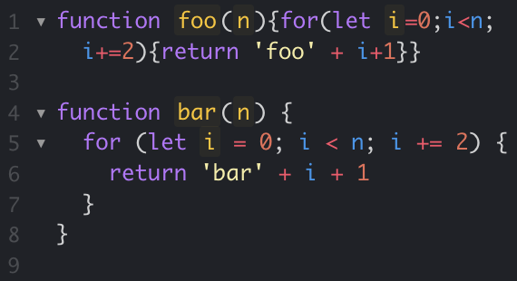

## I needed a tool

I have just been introduced to coding standards. And it feels like the tool I've been missing, since the day I started coding. After some time of fiddling around with getting the syntax right, I have been in inconsistent with how I write my code. As long as it's within the syntax standards, my approaches to making the code readable has, in best case, varied as much as the water level in the Ala Wai Canal. It's within the limits, but you can easily see there are big differences. If you looked at two of my projects, you would think they had been written by two different developers from different backgrounds.

## Is there a problem here?

Sometimes I used normal quotation marks when declaring a string, sometimes I used single ticks. Did I use spaces after commas or around operator? I tried to stay somewhat consistent within a file, but not in a project. And definitely not between projects. What I found the most readable depended on my mood that day. When I collaborated with other developers on projects, we definitely didn't follow the same style, it was easy to see who wrote what. Sometimes we even adjusted each others code to comply with our personal taste. It always turned into a whole mix of standards that was hard to read for anyone.

## Seeing the light

Now, I have been introduced to ESLint, and it's the tool I've missed. It tells me when I'm doing something wrong, it tells me when I'm doing something right. It makes me consistent. I have already noticed how much more readable my code is, after I started using a coding standard. Now I get used to seeing a way of formatting every time, and hence, it's quicker to get an overview over the code, as my eyes don't have to adjust to different styles for every new function. And when others are reading my code, if they're used to the same coding standard, they'll have the same relief. They'll be able to focus on the code, not the syntax. 

