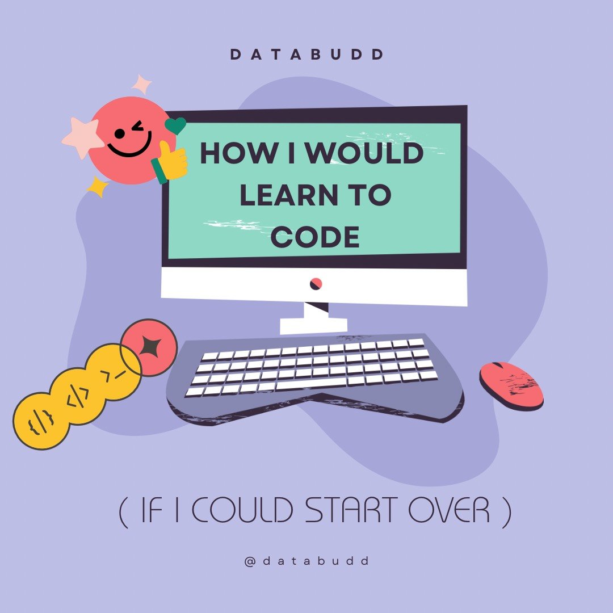

## Starting off right

The Internet is full of videos titled *“How I would learn to code if I could start over today”*. These videos usually feature a software developer, with apparently years of experience, reflecting upon his or her programming journey. I’ve stopped watching those videos. Because I find myself in a situation, where if I was to start learning how to code all over, I would do it in the same way again. I’m not saying I knew the stairway to heaven before I started, my journey has been directed by the schools I’ve attended.

## The beginning

My first *“Introduction to Programming”* class used Python. Because why wouldn’t it? Python is a high-level, close-to-English-ish language, which makes sense for a non-developer brain. I had never seen a line of code in my life before starting to learn Python, yet I was still able to read a few lines of code and understand what was going on straight away. This makes Python a language that is fun to learn for beginners. We understand why the program is behaving as it does, and with Python being the most popular programming language, <a href="[https://github.com/einar-m/TFY4107-lab](https://www.forbes.com/sites/forbestechcouncil/2022/12/28/what-your-software-partner-should-know-the-top-programming-languages-of-2023/?sh=75fd57d1182b)">according to Forbes</a>, it’s easy to stay motivated.

## Feeling like a pro

Then it was time for me to move on in my coding journey. Next stop: object-oriented programming with Java. “*Okay, this is new!”* Where did all the curly brackets come from? What do you mean I don’t have to follow indents strictly? And who thought:

```java
System.out.println("Hello World!");
```

was better than the good, old:

```python
print("Hello World!")
```

Still, there was something intriguing about Java. I had to be more rigorous with types and return values. It felt more low-level, and I felt more professional. *“Look at me, I need to remember to count the curly brackets!”*.

## One step too deep

When I started writing a few, simple programs in Assembly, I started missing the simplicity of Python. I wanted to be able to just write down code as fast as my brain could think, I wanted the flexibility to change types. And I wanted to be able to read my code, without having to filter out all the technicalities.


## The missing piece

And there she was. The answer to my prayers. Next in line: JavaScript. By looking at it, I felt the same way as I did with my first encounter with Python. Simplicity. I understood what was going on. And at the same time, I got a feel of how powerful this language is. I had looked at JavaScript as a missing tool in my toolbox. Everyone was talking about web development, JavaScript, React and Node, but I didn’t have anything to contribute to the conversation. Until now.

## I want more!

I feel very motivated to progress in my software engineering career. JavaScript, HTML and CSS, as I’m learning this semester at school, will finally allow me to build frontends as well, not just backend. I will be able to create webpages I can show my mom, and she can pull it up on the other side of the globe! I enjoy learning new things, and one of my favorite things about programming is how you actually create something. It’s not abstract. You can use your code to solve everyday problems, or you can create something revolutionary. And regardless of which language I’ll work with in the future, I believe knowing several languages will give me a better understanding of computer science as a whole. Which is why I look forward to learning JavaScript this fall. And after that? I want more!


