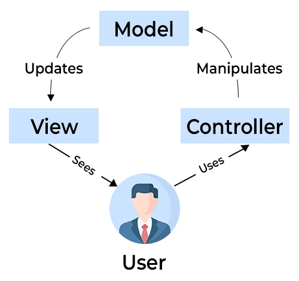

## Starting without a plan

It's not until you actually start building big projects, you realize that you need to have a plan for you code. You can't just start writing, and hope everything works together well. What if you come up with another idea half way through that you want to implement? What if your code turns out to be more complex than what you initially thought, or you start to lose track of you way to long one-file solution. It's when you start building these projects, you have to consider which design patterns to chose.

A design pattern is a general, reusable solution to a commonly occurring problem within a given context in software design. It is a concept or template for how to structure code, that can be used in many different situations. Design patterns aren't academically defined concepts, but rather best practices on who to tackle common problems. One example is the observer pattern, which is used when you have several files or models that need updated info when a given event happens. By creating a specific class method that notifies other classes of the event, other classes can subscribe to this method and get notified when the event happens. This way, you don't have to manually update all the classes that need the info, and it's easy to add or remove classes that need the info.

## So many options
In my early coding days, the longest code I had written was a 400 line Sudoku program, all in one file. When my next task was to build a (very basic) hotel booking system with a working user interface, I was lost. Luckily this was a school project, and the course introduced us for what they called "design patterns". Our project was going to be based off something they called model-view-controller. We built a frontend in FXML and backend in Java, and the user interface (view) only communicated with the backend (model) through a single  file (controller). This approach made it easier for us to add more functionality to the program as the course progressed, without having to redo our whole codebase. By adding observer functionality to the booking class, all the other relevant objects could get the info right away, like the room-object.

There are countless design patterns, and if you think hard enough, you could probably think of a slightly different way to structure code and give it a name. In a website I'm building as another school project, we use Mongo collections as our database. We have created classes that create an instance of each collection, and use this globally. Even though this seems like an intuitive and straight forward way of doing it, it's still a design pattern: singleton. Using global variables to control the state of the program. The collections are published from the server following a set of rules, and other classes can subscribe to these collections. This publish/subscribe pattern is very similar to the observer pattern.

## Learn the basics

Even though many design patterns overlap, and some seem intuitive, I believe every programmer should study the basic design patterns used in the language or framework they're using. And before starting on a new project, do some general planning, and think of which design patterns that will be the framework of you application. It's much easier to add functionality to a well designed codebase, than to try to restructure a mess.
