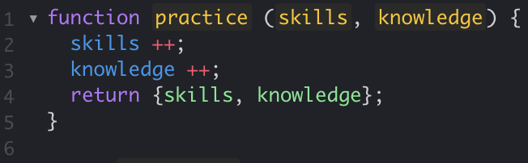

## JavaScript is a hot topic
People talk about JavaScript. A lot. I hear about JavaScript all over the place. Yet, I had never seen JavaScript code. Before I started my third year of studies. The minute I walked into the classroom in the class *“Software Engineering 1”* JavaScript got thrown at me. *“Solve 140 JavaScript problems before the next class”* was the only thing I remembered my professor saying, when I walked out of the classroom an hour later. Mildly shocked.

## Time to focus
*“Okay, clear my schedule, this weekend will be all coding”* I said to myself on the way home. Gone were all surfing plans, I rain-checked a hiking trip and closed the curtains to my living room. I opened the first problem, and to my big surprise, I understood what was going on at once. I clicked on the next problem. Same. Next problem. *“Honestly, JavaScript makes sense!”*. By getting rid of technicalities like return types, and strict array value types, I was able to get right on with writing lines. This was fun! By the end of the night, I had finished almost all the assigned problems. I went to bed with a smile on my face, looking forward to tackling the last problems. And, texted my friend I was looking forward to the hike.

## Learning the flow
I am still amazed, by this day, how quickly it was possible to get a hang of JavaScript (with having coding experience from another language already). And knowing all the frameworks and possibilities you have with this language as well, makes it a motivating one to learn. Now that I’ve learned the basics, it’s time to practice. A lot. Getting a hang of JavaScript is one thing, being competent and fluent is another. This is where I believe lots of practice is important. I wasn’t able to write functions in such a short period of time just because of the language, it was also because I because I solved 140 problems. Not 40. 140. By the time I reached the end of the introductory problems, my fingers already threw around curly brackets and let's, before my brain comprehended a possible solution.

## To the future!
Practice is what’s going to make me better in the future as well. Solving numerous minor brain-twisting problems, while also creating more complex projects, will give me the introduction to the language I need, to go on and be creative with JavaScript when I’m done with *“Software Engineering 1”*.
