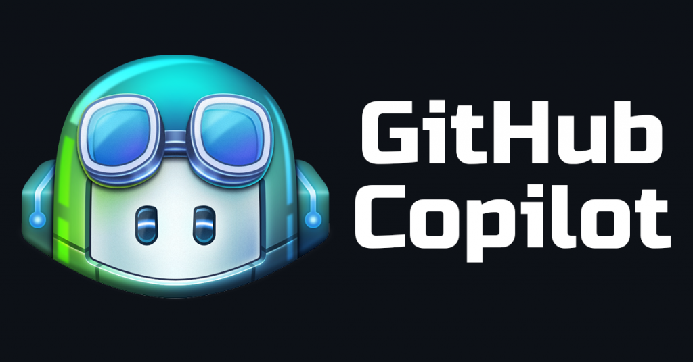

## Introduction
Just like everyone else, I was stunned and surprised when OpenAI launched their first publicly available ChatGPT model. I had previously been introduced to applications of AI that impressed me, like how Siri works, and how it's possible to use natural language processing models to categorize documents. Still, the way ChatGPT was able to generate it's own answers, not just linking to a website like Siri did, was mind blowing. I was excited about the new technology, but didn't know how to use it for my own advantage. Until the fall of 2023, when I integrated GitHub CoPilot to my main IDE, and realized how powerful of a tool AI can be.

## Personal experience
It was my professors in a software engineering class, who started talking a lot about AI. They encouraged us to try different AI tools, and demonstrated real life usage in class. In the beginning of the semester, we did a lot of short coding challenges in an online editor, similar to coding challenges you would expect in an interview. For me, it felt like more of a hassle having to switch tabs to ChatGPT, write a prompt, copying back the answer, edit the snippet to work for my code and so on, than just writing the code myself.

But then we started with more complex assignments, and moved back to a conventional desktop IDE, with my freshly installed GitHub CoPilot. And that's the turning point for my use of AI. CoPilot integrated seamlessly with my standard workflow, and I could evaluate CoPilots suggestions at the same time as I was writing my own code. This made the process of using AI way more streamlined.


The first time I realized the potential in CoPilot, was when I was doing an assignment where I was supposed to implement sumOfNumbers() in three different ways. To avoid having to switch back to check on the task every now and then, I copied the task into my JavaScript file, so I could easily check on it.
```javascript
// Write four functions that return the sum of the numbers in a given list using a for-loop, a while-loop, recursion, and underscore. Call them sumFor, sumWhile, sumRecursion, and sumTheSimpleWay.
```
Before I had time to get on with the task at hand, all three functions were displayed on the screen, in a grey shadow like manner. CoPilot had implemented all the functions using the correct library, and waited patiently for me to press ```tab``` before the code was actually inserted. It even included text arrays and calls for me to test that it worked properly.

The essays displayed in my portfolio are written in my IDE. Hence, CoPilot does it's best at autocompleting my sentences and paragraphs here as well. This is a tool I'm more reversed against using, as I'm not too sure about the text in enters won't be somebody else's, and I want my reflections to be my own. I do however, feel like CoPilot adapts to my writing style, and a lot of its proposals look like things I could've written myself. And with English being my second language, looking at the suggestions gives a lot of inspiration and help for my vocabulary.


## Impact on learning and understanding
I've tried throughout the semester to be considerate on when I'm learning new topics, and when I'm doing stuff I already know. When I'm implementing code I know how works, and which I know I could've written without any problems, I use CoPilot a lot to speed things up. Examples of this could be CoPilot writing the imports for a file, listing up the PropTypes in React or setting up my Boostrap grid in HTML.

On the other side, when I'm learning new things, I think use of CoPilot should be limited. If I would have CoPilot autocomplete all my lines for me, I would probably not get the same understanding and memorization as when I'm typing out the lines myself. Do help me stay creative with my problem solving skills, I've also stopped copying in the task description as a comment, as this made CoPilot suggest a whole file of code without requiring any input from me.

To this day, I only use CoPilot for autocompleting my lines of code after I have started on them. I do not write descriptive comments first, and let CoPilot do the rest. This would probably increase my effectiveness even further, but as I'm still a student, I think it's important for my learning that I still do some manual coding.

## Practical applications
My experiences with AI from software engineering has motivated me try implement it in different areas as well. Using ChatGPT as a study partner has been a great improvement to my study sessions. I've asked ChatGPT to review a term, define a concept, or explain a topic with different wording than my book. ChatGPT has also proved itself as a great brainstorming partner. For my team's final project in a software engineering class, ChatGPT was kick starting the brainstorm after I asked it to "come up with ten catchy names for a website that connects college hobby musicians". "UniSounds", "CampusChords" and "MelodyMates" are examples of what it proposed. Even though none of them turned into our final name, it was a great help to get the creativity going.

## Challenges and opportunities
Even though I'm a fan of accepting CoPilot's suggestions while I'm writing code, this apprach has been limited to only completing lines or sometimes up to three lines. I have not found any quick ways to make CoPilot author larger sections of code. And for me to use AI in coding, it needs to be quickly to access. Just a few days ago, I got early access to CoPilot Chat. CoPilot Chat is a generative AI chatbot, similar to ChatGPT, that lives inside your IDE. By a quick keyboard shortcut, it opens up on the right hand side of the screen, as an expert coding companion always ready. When CoPilot Chat suggests code, I get the opportunity to insert the code directly into wherever I want to in my project. This tool seems very promising, and I'm excited to see how it will develop my workflow. 



## Comparative analysis
For learning, it's a good idea to be considerate on how you use AI. As mentioned, I think the learning outcome will be not as good, if you use AI to write the majority of your code, as you will not remember the concepts as good, as if you'd written it yourself. Just reading the autogenerated code does also make you less likely to discover small, important nuances in the syntax, that could possibly change the way your functions performs, if it would've worked at all.

On the other side, I believe college classes is a great place to start using AI in your development. Personally, I get motivated to keep on working with assignments if I keep having progress, and don't get stuck on small errors. AI has been helping me keep up the pace in my coding, and when things don't work, it has helped me locate the issue, and maneuver around it. A college class will also provide you with a mature introduction to the use of AI, as it is a skill to master. Having a class and a professor as resources, you can get tips and hints about the use of AI, and learn enough about the new tech stack in the class, to be competent enough to spot the errors AI may introduce in the code. I do also think college classes should spend even more time talking about the use of AI in class, and show more examples of usage.

## Future considerations
In the future, I will keep on limiting my use of AI when it comes to writing lines of code when learning a new topic. Then, the more comfortable I get, the more should AI be implemented in the process. Regarding using AI as a study partner, I hope I will use AI even more, to make my study sessions more effective. Diving into the possibilities of CoPilot Chat is something I'm looking forward to, and I think using it to explain template code I don't understand is a great start. 


## Conclusion
Bottom line, I believe AI in software engineering is a set of tools that will revolutionize the way we code. We will be able to code faster, and do less repetitive coding. AI will also be a way more accessible helper when you get stuck. In the beginning of my software career, StackOverflow and similar websites has been great for getting help, but in the future AI will replace the need for online forums. The skill of writing good prompts is something that will be important to get the most efficient use, and what will be my main focus in enhancing my use of AI even further. 
