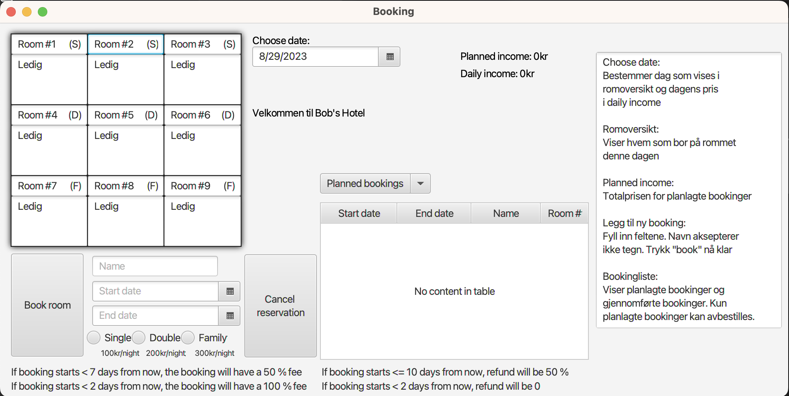

The BookingApp is a desktop application that could be implemented by any hotel! The app has an interactive view of all the rooms on a current date, displays current and previous bookings, and lets you add new bookings. And the most important: it lets you know how much these bookings will cost.

See a screenshot of the application at the bottom of the page.

How to use the app is enclosed on the right-hand side of the screen, in Norwegian. The application requires the user to log in. Due to this being a school project, the credentials are listed on the login screen, this would of course be removed before giving the application to customers.

The application has only one view, so you get all your info in one place. A table showing the hotel's 9 rooms is live updated, and will show availability immediately when you change the date. The bookings and booking archive are stored in local .csv files. The application will always start up with displaying today's date, and will not let you add bookings back in time. The price for the room is calculated based on formulas including the type of room and how many days in advance the booking happens. You can close your application any time and be safe that the new bookings are already saved, and will be shown the next time you open the application.

The project was done as a part of an intro to OOP class. I wrote it together with a partner, Benjamin Bøe, and this was our first time using Java, FXML, and JUnit. We worked on all of the code together. The FXML files were created interactively with the program SceneBuilder. As this was my first major project, I developed a much bigger understanding of how programs can use a variety of files, how to structure code into different files in the most efficient manner, and excessive use of imports. The JUnit-test revealed several mistakes in our code, that we wouldn't have discovered without them, so it was also a big heads-up on the importance of writing good tests.

