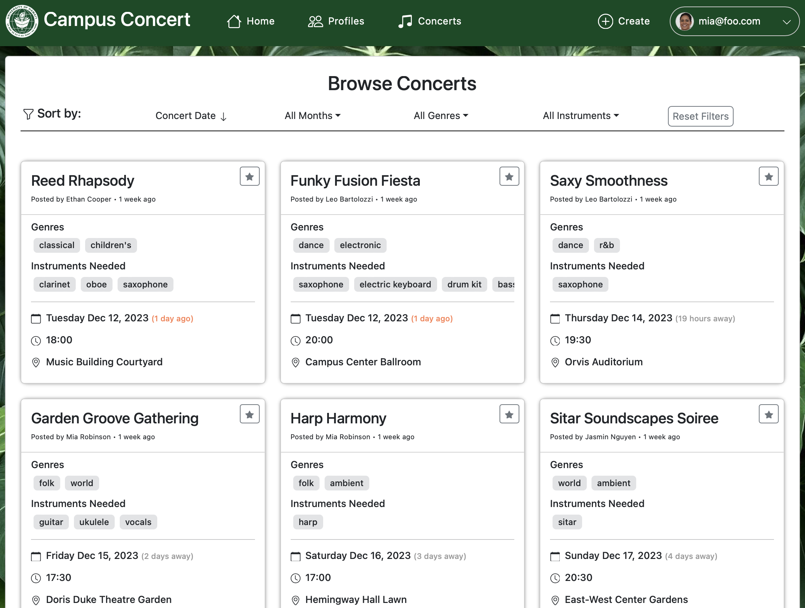

Campus Concert was the final project in a software engineering class at University of Hawaii. The class taught basic skills in JavaScript, HTML, CSS, and React.js, and the project was about creating an interactive webpage, with a working database. My team consisted of six persons, and in five weeks, we created a website aimed at student musicians to discover each others tastes, goals and instrument skills. All the users could also create concerts, where they could inform the community of their upcoming event. 

As much as this was a project focusing on implementing and deploying a webpage, it was also a project to learn agile project management. We used GitHub to host our code and project boards. In weekly meetings, we discussed current progress, and made sure the project boards always had new issues to work on. Everyone merged their work to main without any explicit approval, so we implemented tests to make sure everything still worked as supposed. 

My contributions to the project has been ranging from the implementation of new features, to updating the documentation. I did the initial configuration for deployment of the webpage, including setting up a custom domain and https. Featuers I've implemented includes the inital filter
functionality, the admin functionality of moderating concerts and profiles, and reworking the navbar. One of my key takeaways from this project is the importance of proper git usage, with correct branching and merging, and the importance of testing, to make sure you don't break anything when redoing something else.

- Documentation can be found [here](https://campus-concert.github.io/).
- The deployed website can be found [here](https://campus-concert.com/) (webpage will be taken down, but can be run locally, see documentation).
- Codebase can be found [here](https://github.com/campus-concert/campus-concert)

