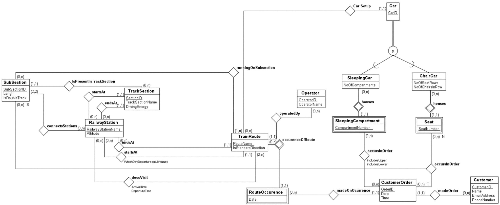

Nordlandsbanen was created together with partner Tallak Ravn in a class about databases. We used SQLite to create and maintain databases, and Python as a way to make it interactive.

The database contains which trains depart on specific weekdays, how many train cars they consist of, and if they're sleeping cars or normal cars, which station they stop at, and what time they stop at said stations. The highlight of the user interface is the script that shows which seats and which sleeping beds are occupied.

I was responsible for setting up the databases using SQLite, and writing the interactive Python script. My partner made the ER diagram and wrote most of the documentation. This was the first time I used SQL and databases, and it gave me a better understanding of the proper use of this concept. Earlier, I had mostly used .csv files for storing values from a program, so SQL gave me a tool that was way more powerful for storing and handling data. The documentation for the project included an ER diagram of the database, as you can see below.
 

